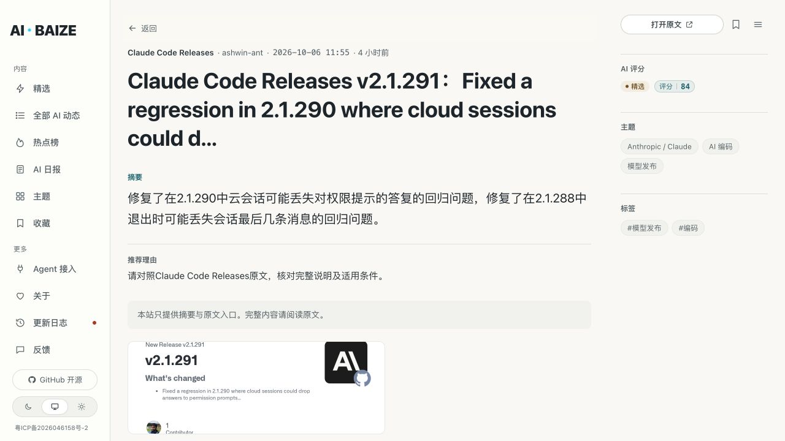

# 中文摘要修复与生产验收

## 结果

生产发布标识为 `20261006-chinese-summary`，地址为 https://www.aibaize.cc/ 。中文摘要功能已恢复，自动采集和摘要生成均已启用。

- 首次定向回填 215 条：204 条直接恢复原文已有中文，9 条采用核对通过的本地模型译文，2 条模型草稿经原文校订。
- 另修订 1 条旧模型将 Seedance 误译为“种子集”的条目；本次共处理 216 个不同 ID。3 条经过校订的模型摘要以 `ollama:qwen3:1.7b:reviewed` 保存，未冒充未经校订的模型原始输出。
- 当前 OpenRouter 15 条原先失败的条目均已恢复；生产数据库检查显示该来源组没有 `rules` 降级结果。用户所见 `item-qpkrcy` 的 Claude Code 摘要也已恢复。
- 这不是全站历史摘要逐条审校完成的声明。其余历史失败摘要仍由自动队列处理，旧模型既有成功结果也未全部重新生成。

## 根因与改动

生产 API 原先未设置 `OLLAMA_MODEL`，实际使用默认 `qwen2.5:0.5b`，超时仅 20 秒。实测中 0.5b 会返回英文事实；1.5b 虽能返回中文，却会生成占位式推荐理由，旧代码因此丢弃整条结果。旧统计还把降级摘录计为成功，失败后等待 12 小时再试。

现在：

1. 中文事实与推荐理由独立校验。不合格或缺失的理由使用中性原文核对说明，保留合格摘要及人工明确理由。
2. 已有中文原文直接使用；AIHOT 中英混合摘录中明确附带的中文译文也可直接提取。
3. 只处理原文摘录，限制长度、结构和资源；数字先保护，再还原原始写法。数字校验比较数量，拒绝把 `230k` 改成 `230万`，允许正确的 `23万` 或 `230,000` 表达。
4. 对含 `cannot/unless/without/not` 的原文启用模型推理，拒绝把“不能合并”改写成“防止……无法合并”的反向条件。
5. 保存实际模型和失败原因，30 分钟后可重试；模型变化后不沿用旧失败冷却期。成功、失败、应用数和各 provider 分别统计，部分失败不会记为全部成功。
6. 合并结果前重读当前数据并核对原文；保留 ID、发布时间、隐藏/置顶状态、反馈、公众号文章和明确编辑理由。

最终采用本地 `qwen3:1.7b`，不接入付费 API。模型信息和 Apache 2.0 许可证见 [Ollama 模型页](https://ollama.com/library/qwen3:1.7b)及[随模型提供的许可证](https://ollama.com/library/qwen3:1.7b/blobs/d18a5cc71b84)。Qwen2.5 和专用翻译候选中未通过核对的输出未写入生产。

## 验证

- 摘要模块 24 项测试通过，新增回归先复现失败再修复。
- 完整后端 324 项测试通过，网站生产构建通过。
- 生产候选环境的 24 项摘要测试通过。
- HTTPS 80 项检查通过，包含页面、公开接口、海报、静态资源及管理边界；见 [检查结果](2026-10-06-summary-smoke.json)。
- 真实样本逐条核对：Claude Code 权限答复/退出消息丢失、路由三层、工具定义结构、CI 评估合并门禁、Batch API 价格和数量限定。
- 浏览器实际确认 Claude Code 详情页及 OpenRouter 主题页显示中文，详情页证据见下图。

## 发布、资源与数据保护

候选目录 `/opt/aibaize-releases/summary-check-20261006` 使用数据库副本。通过校验后才部署摘要模块、采集增强日志和服务配置，再按明确 ID 合并已核对的候选输出；没有用本地数据库覆盖生产数据库。

2 CPU / 4 GB 主机上，Ollama 限制为一个已加载模型、单并发、一个推理线程、2048 上下文；服务 CPU 上限为一个核心，内存软/硬上限为 2200/2400 MiB。API 使用 90 秒超时、20 条批次。模型推理期间网页实测返回 200，约 0.36 秒；服务保持运行。

临时暂停自动增强的 `30-summary-repair.conf` 已删除；采集没有关闭。生产进程环境已确认模型、并发、批次、重试和发布标识生效。重新采集后的运行记录已显示 `scheduled: true, limit: 20`。

首次回填的 215 条中，后续正常采集在 2000 条库存上限下淘汰了 43 条较旧、未置顶记录；保留记录的发布时间、隐藏/置顶状态没有变化。原反馈及公众号文章保持存在。这一正常库存变动未通过恢复旧数据库撤销。

## 回滚

私有备份目录为 `/opt/aibaize-rollbacks/20261006-summary`，包含 `code-predeploy.tgz`、`20-editorial-predeploy.conf`、`ollama-before.service` 和多个发布前数据库快照。目录仅供服务器管理员访问，未提交到仓库。

代码回滚可恢复备份中的摘要模块和刷新任务、旧 API 服务配置，再重新加载并重启 API。摘要内容回滚应按本次 ID 从快照恢复相应摘要字段，同时保留新的采集、反馈和人工编辑；不要整库覆盖当前运行数据。前端及 Nginx 路由未在本次修改。
