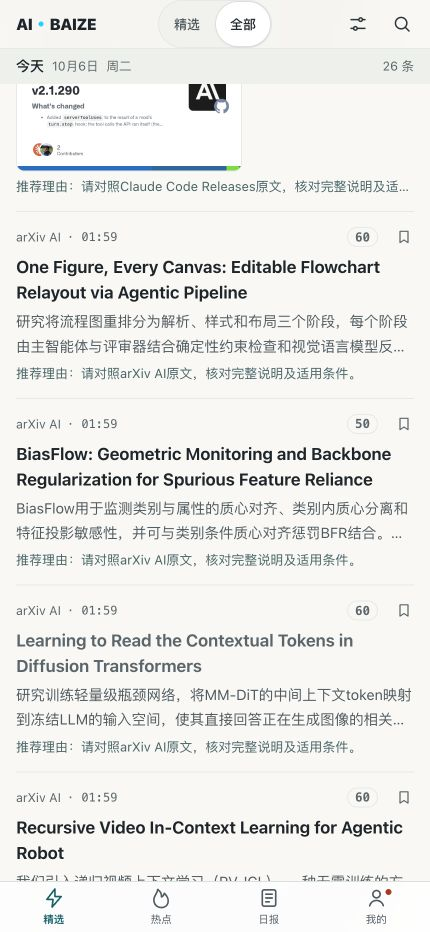
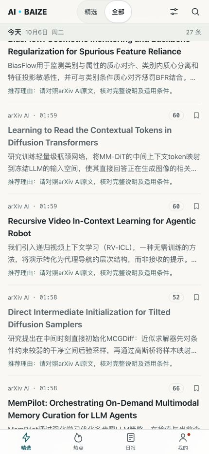
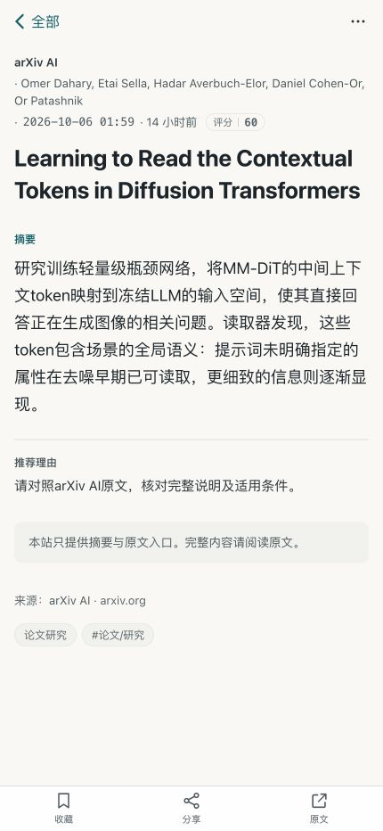

# “全部”列表中文摘要修复

## 已验证的范围

生产发布：`20261006-summary-queue`，地址：[全部动态](https://www.aibaize.cc/all)。

用户截图中的五篇论文已恢复完整中文事实摘要：BiasFlow、Contextual Tokens、Recursive Video In-Context Learning、Direct Intermediate Initialization、MemPilot。同时补齐今天的 One Figure、CLIFT、Cowork 动态，并校订 Claude Code v2.1.290 的已有草稿，共 9 个明确 ID。

8 条摘要根据原文校订，保存为 `ollama:qwen3:1.7b:reviewed`；1 条模型原稿核对后保留。原文、模型草稿及校订记录保存在服务器私有候选目录，公开仓库只保存来源链接、最终摘要和审查说明：[逐条审查](2026-10-06-summary-queue-review.json)。没有将人工校订冒充纯自动输出。

这不表示全部历史库存均已逐篇审校。旧失败结果和旧小模型结果仍有积压，由更新后的后台队列继续处理；模型未通过校验时继续展示明确标记的原文摘录。

## 根因与修复

1. 旧队列先按 preferred 和分数排序，每次采集后只处理一批。低分 arXiv 条目长期排不到。现在交替为优先来源的新记录、“全部”中的新记录、旧失败重试分配位置；新记录按发布时间排序，重试按上次尝试时间排序。
2. 旧代码等待全部请求结束才写回。现在每条完成后立即核对原文并保存，后续超时和进程重启不会隐藏已完成结果。继续保留并发反馈、隐藏状态和明确编辑理由。
3. 批次结束后间隔 60 秒继续处理，不再依赖下一轮采集。只允许一个后台批次运行；采集触发可替换等待中的定时器，不会叠加后台批次。
4. 旧模型的“成功”摘要不再永久跳过。配置模型变化后会重新处理；当前模型、人工校订和当前视觉模型的已完成结果会跳过。失败从 30 分钟开始退避，最长 6 小时；原始材料变化会清除旧失败计数与模型信息。
5. arXiv 摘要改为选择完整的方法句，避免截断半句话；句子切分保留小数和原始限定条件。保留数字占位保护、中文校验和否定条件校验。普通 `not` 不再单独触发长推理；`cannot/unless/without` 继续触发。
6. `AbortError` 的数字代码 20 原先盖过超时分类，现在明确记录为 `model_timeout`。
7. 实际再采集暴露了相关性过滤问题：中文摘要省略英文关键词后，BiasFlow 被误移出库存。现在相关性判断补充原始材料的 AI 证据，保持原有展示摘录的噪声过滤范围；已仅恢复该条原始记录并重新应用核对稿。再次采集后，五篇截图论文仍保留，未置顶绕过过滤。

## 验证证据

- 新回归先复现失败，再修复：队列公平性、逐条保存、旧模型更新、超时分类、句子/小数完整性、失败退避、批次自动续跑、材料变化后的状态清理、中文摘要不改变论文保留资格。
- 最终后端测试 **334/334** 通过；生产构建通过。候选服务器摘要、调度与存储测试 **38/38** 通过。
- HTTPS 页面、公开接口、静态资源、海报及管理边界 **80 项**通过：[部署检查](2026-10-06-summary-queue-smoke.json)。
- 9 条摘要的公开详情接口与核对稿逐字匹配：[专项线上检查](2026-10-06-summary-queue-verification.json)。
- 第一批正常后台增强于 `2026-10-06T08:14:36.658Z` 完成：20 条成功、0 条失败，其中 16 条本地模型结果、4 条已有中文原文。批次完成前已实际观察到多条摘要写回，覆盖优先来源、低分论文和旧模型更新。
- 最终部署后的批次于 `08:27:00Z` 完成：17 条成功、3 条拒绝，失败分别为超时、无依据数量、错误数字占位符。到 `08:29:50Z`，新的摘要已保存，而最近采集时间仍为 `08:21:27Z`，证明下一批在采集之间独立推进。拒绝结果未算成功，见[续跑记录](2026-10-06-summary-queue-continuation.json)。
- 手机尺寸 430×932 实测“全部”与论文详情。列表证据显示新摘要，保留来源与原文入口：

## 数据保护与回滚

使用独立候选目录和数据库副本核对草稿；生产只按明确 ID 与原文一致性合并，不使用本地数据库覆盖运行数据。核对时原有反馈均存在，8 篇公众号文章保留；ID、发布时间、隐藏/置顶状态均保留。

新增私有备份：`/opt/aibaize-rollbacks/20261006-summary-queue`，包括发布前数据库快照、`code-before.tgz`、API 服务配置、`scoring-before.js`、`store-before.js`。代码可恢复这些文件后重启 API；内容回滚按本次 ID 恢复摘要字段并保留后续采集与反馈。Git 历史保留全部重建和修复提交。

继续使用本地免费模型和既有资源限制；本次没有付费接口、前端布局或 Nginx 路由变更。采集仍按每 30 分钟运行，摘要后台独立续跑。部分免费信源请求失败仍在健康记录中明确报告，未计为全部采集成功。
